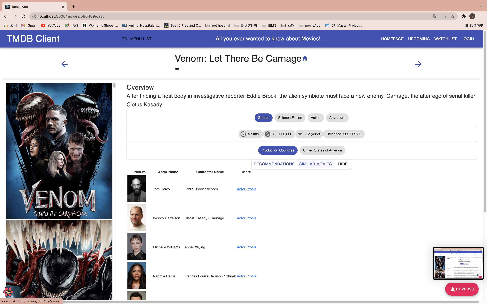

# Assignment 1 - ReactJS app.

Name: SIJIE HE

## Overview.

A React app that uses the TMDB database to get movies and actors

### Features.

#####  Overall Features,

+ Feature 1 - 10 new TMDB endpoints.
+ Feature 2 - 10 new views.
+ Feature 3 - Routing （Including parameterized URL).
+ Feature 4 - Dynamic and interactive UI, Material UI.
+ Feature 5 - Flitering and Sorting
+ Feature 6 - TMDB user authentication.
+ Feature 7 - Storybook support.
+ Feature 8 - Web Form (reviews, log in).
+ Feature 9 - Styled Components 3rd party components.
+ Feature 10 - Full Caching support.

 ##### Details,

 + Feature 1 - Popular actor List Page: The user can see all the popular actors in the form of card sorting by popularity. 
    + Actor sort switch button : User can click the buttons to actors by DECS or ASC.
    + The user can add interested actor to the actor list
 + Feature 2 - Actor Page: User can view the Actor's basic information.
 + Feature 3 - Use new Material UI component 
    + build a temporary drawer - entrance for ( Favorite Movies, Play List,NowPlaying Movies,Toprated Movies,Popular Movies,Popular Actors,Liked Actors,Search TV) combine this new element into the old site components
    + switch Button - Click the button to switch between different states
    + rating Button - The user can slide the mouse to rate the movie
 + Feature 4 - new Detail Page, add the buttonGroup contain the links to the similar movies , recommentation movie, new function - see the related cast.
    + The user can the related information below the movie details.
    + The user can click the hide button to return the movies datails page.
 + Feature 5 -  Credits page : the user can see the credits about the movie and can link to the full information about the cats 
 + Feature 6 - Search tv page : the user can enter the name about tv and get the poster and name about tv
 + Feature 7 - use the TMDB account to login .
 + Feature 9 - Toprated page : the user see the toprated movie and add it to playlist
 + Feature 10 - Popular page : the user see the popular movie and add it to playlist

## Setup requirements.

```
npm install
```

If you make any change 

```
npm run build 

npm run analyze
```
## API endpoints.

+ Discover list of movies - /discover/movie
+ Movie details - movie/:id
+ Movie genres - /genre/movie/list
+ Nowplaying movies -movie/now_playing
+ Popular movies on TMDB. - movie/popular
+ Top rated movies on TMDB. - movie/top_rated
+ Upcoming movies in theatres. - movie/upcoming
+ Posters about a movie. - movie/{movie_id}/images
+ Reviews for a movie. - movie/{movie_id}/reviews
+ Recommended movie. - movie/{movie_id}/recommendations
+ Cast and crew for a movie. - movie/{movie_id}/credits
+ popular people on TMDB. - person/popular
+ Person details . - person/{person_id}
+ Images for a person. - person/{person_id}/images
+ Similar movie. - movie/{movie_id}/similar
+ Search TV. - search/tv
+ Login authentication. - authentication/token
+ TMDB account - /account

## App Design.

### Component catalogue.

+ screenshot from the Storybook UI


### UI Design.

[ Insert screenshots of the __new/modified app pages__ you developed (and modified existing pages), Include an appropriate caption for each one (see example below).

>I redesigned the homepage and changed the style and layout of the page.


>I added a temporary drawer called Menulist to sideHeader, and clicked on it to see some of the other pages


>Now we can the temporary drawer on the left of page and can click the any link below.


>We click on the "Popular Actor" button to see the entire actor page.


>Now we see the entire popular actor list page. On the left side of the page, there is a search and sort card that allows us to search for actor names in the input field and sort them by popularity. (Descending by default)


>Click the switch button to change the sort of popularity


>We can also enter the name of the actor you want to search in the input box, and select the sort status


>We can also click on the button below each actor's profile card, and an Avatar will appear on top of the card.


>Let's go to the Liked Actor interface and see the actor we just added


>Click MORE INFO below the actor profile card to view the details of the actor


>When I saw the new Movie Detail interface, I added a BUTTON GROUP under the detail,contain the links to the similar movies , recommentation movie, new function - see the related cast


>Click different buttons below to jump to different interfaces




>Click the Full Details button to jump to the appropriate page


>Click the Actor Profile button to jump to the appropriate actor profile page


>Display the SearchTV page, enter the name of the TV in this input box to display the poster for the TV


>On the movie review page, there is verification for the user name and length of content when we write the evaluation, so it cannot be submitted if it does not meet the requirements. At the bottom of the page, I also added a rating component


>Enter the film review that meets the requirements, you can successfully submit


>I also used the third-party verification, and I got the account information in TMDB, so I could log in using my TMDB account


>When the account or password is incorrect, it will prompt an error message


>We can also view popular movies on the website in TMDB data


>Full caching support by using useQuery.


### Routing.

[ List the __new routes__ supported by your app and state the associated page.]

+ / - displays discover movies.
+ /movies/:id - displays detailed information page of a movie.
+ /movies/:id/credits - display credits of a movie.
+ /movies/:id/similar - display similar movies of a movie.
+ /movies/:id/recommendations - display recommended movies of a movie.
+ /movies/topRated - display top rated movies list.
+ /movies/popular - display popular movies list.
+ /movies/nowPlaying - display now playing movies list.
+ /movies/upcoming - display upcoming movies list.
+ /movies/favorites - display movies added in the favorites list.
+ /movies/playlist - display movies added in the playlist.

+ /reviews/form - display form to add a new review.
+ /reviews/:id - to get a list of reviews of a movie.

+ /actors - display the actors list page.
+ /actors/:id - display detailed information of an actor.
+ /actors/like - (protected) display the liked actors list aftering logging in.

+ /login - (require authtication) display log in page.
+ /tv - display search tv page

## Independent learning (If relevant).

[ Itemize the technologies/techniques you researched independently and adopted in your project, i.e. aspects not covered in the lectures/labs. Include the source code filenames that illustrate these (we do not require code excerpts) and provide references to the online resources that helped you (articles/blogs).

+ I search the information about how to generate a session from TMDB.The basics to getting a user authenticated include:
    + Create a new 
    + Get the user to authorize the request token
    + Create a new  with the athorized request token

+ the links are below:
    + https://developers.themoviedb.org/3/authentication/how-do-i-generate-a-session-id
    + https://download.csdn.net/download/weixin_42119989/16598548

-------------------------------------------
# Assignment 1 - Agile Software Practice.

## Automated Testing.

### Best test cases.

[ List the top 4/5 test cases ('it' blocks), in your opinion, from your test suite that best demonstrate your competency in writing Cypress test code. Specify the test file name and the starting line number of the 'it' block, 

e.g.
+ cypress/integration/mustWatch-movies-page.spec.js - line 24
+ cypress/integration/actor-bio-page.spec.js - line 32
+ etc

### Cypress Custom commands (if relevant).

[Specify the test file(s) that contain custom Cypress command implementations.]

e.g.
+ cypress/integration/mustWatch-novies-page.spec.js
+ cypress/integration/actor-bio-page.spec.js

## Code Splitting.

[Show a screenshot of the 'build/static/js' folder of your project]


## Independent learning (If relevant).

[State which aspect of the Outstanding grading spectrum you addresses. Include relevant screenshots and links to services used, e.g. Percy project, Deployed app